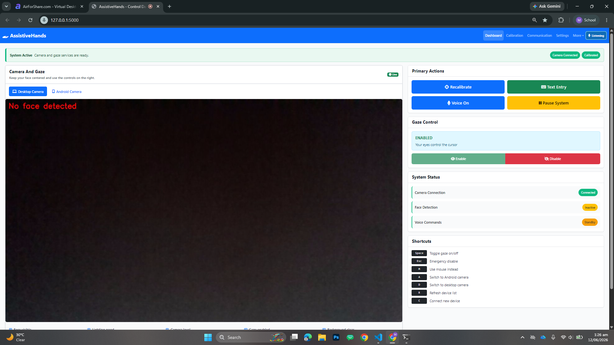
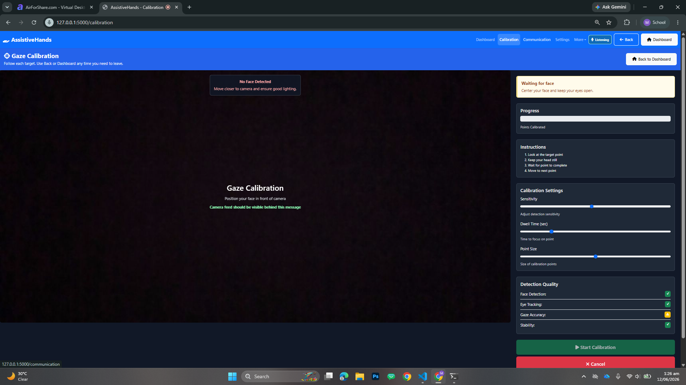
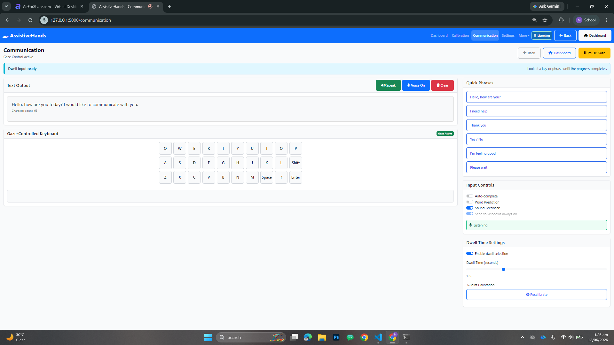
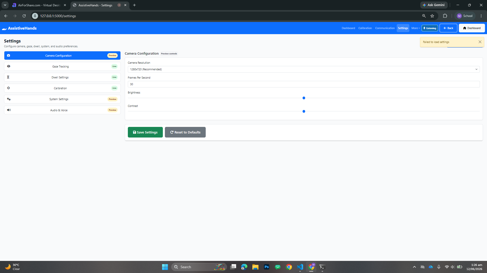
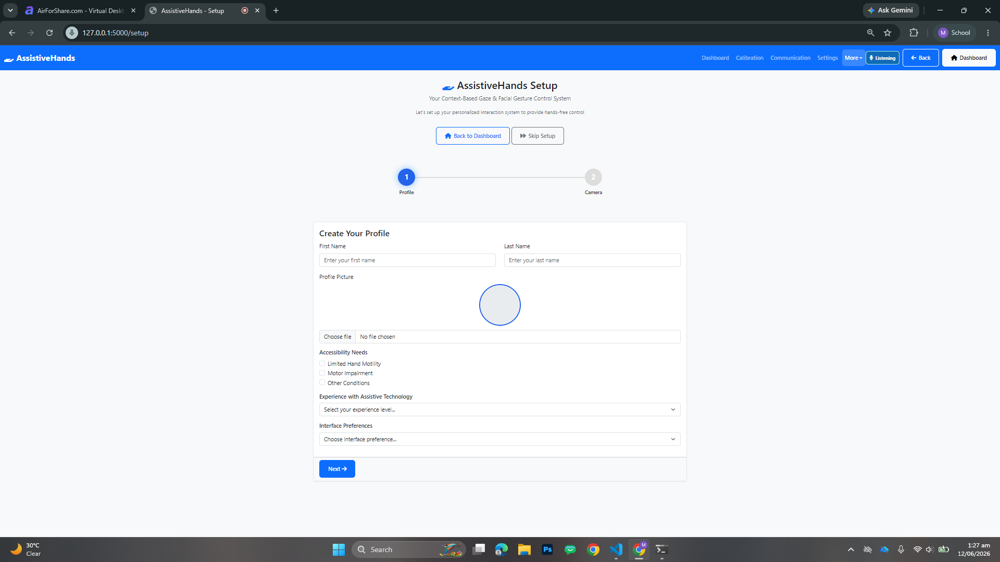

<div align="center">

# AssistiveHands

### Hands-free computer control with gaze tracking, voice commands, dwell selection, and facial gestures.

AssistiveHands is a local Flask assistive-control app that helps users operate a computer through a webcam, eye/head movement, voice commands, dwell selection, blink actions, and an on-screen communication keyboard.


[Preview](#platform-preview) | [Features](#features) | [Flow](#how-it-works) | [Setup](#setup) | [Commands](#voice-commands) | [Tests](#scripts-and-checks)

</div>

---

## Overview

AssistiveHands focuses on practical hands-free access: low-latency cursor movement first, reliable voice control second, and a clean browser interface around both. The app uses OpenCV and MediaPipe for face/eye tracking, Flask for the local control dashboard, browser speech recognition for voice commands, and PyAutoGUI for local cursor, keyboard, click, and scroll output.

The system runs locally at `127.0.0.1:5000`, starts voice listening automatically when the browser allows it, and keeps the core control flow available from dashboard, calibration, communication, settings, setup, and debug pages.

---

## Platform Preview

### Control Dashboard



Main control surface for camera status, gaze enable/disable, voice control, recalibration, text entry, shortcuts, and session telemetry.

### Gaze Calibration



Calibration workspace with camera readiness, point progress, detection quality, dwell timing, sensitivity, and start/cancel controls.

### Communication Keyboard



Gaze-friendly text output, dwell keyboard, quick phrases, speech output, and voice-assisted typing controls.

### Settings



Configuration area for camera, gaze, dwell, calibration, system, and audio preferences.

### Setup



First-run setup flow for profile details and camera preparation.

---

## Features

- Realtime webcam gaze tracking with OpenCV and MediaPipe FaceLandmarker
- Gaze-to-cursor control with smoothing, cursor step limiting, and calibration support
- Voice navigation, clicking, scrolling, typing, punctuation, gaze control, and system pause/resume
- Dwell-based selection for the communication keyboard and gaze targets
- Blink/click command path for hands-free selection
- Communication page with quick phrases, speech output, and system text forwarding
- Realtime command bus, scroll worker, state store, MJPEG camera stream, and SSE telemetry
- Dashboard, setup, calibration, communication, settings, and debug views
- No-device unit tests for realtime command and worker behavior

---

## How It Works

1. The Flask app loads `models/face_landmarker.task` and serves the local dashboard.
2. The camera stream feeds OpenCV and MediaPipe processing.
3. Face, iris, blink, and head-position signals are translated into normalized gaze/cursor targets.
4. Commands from voice, UI buttons, dwell events, and API calls pass through the realtime command bus.
5. Cursor movement, clicks, scrolling, keyboard input, and text typing are executed locally through PyAutoGUI.
6. Calibration output is saved under `assistive_hands/data/calibration/` for the current machine and camera setup.

---

## Tech Stack

| Area | Technology |
| --- | --- |
| Backend | Python, Flask |
| Vision | OpenCV, MediaPipe FaceLandmarker |
| Processing | NumPy, SciPy, scikit-learn |
| Local Control | PyAutoGUI |
| Frontend | HTML, CSS, JavaScript, Bootstrap |
| Realtime | MJPEG stream, Server-Sent Events, command bus |
| Tests | Python `unittest` |

---

## Project Structure

```text
assistive_hands/
  app.py                         Main Flask app and realtime control loop
  realtime/                      Command bus, state store, scroll worker
  ui/templates/                  Dashboard, calibration, communication, settings
  ui/static/css/                 Application styling
  ui/static/js/                  Dashboard, voice, telemetry, dwell, page logic
  camera/                        Camera and gaze helper modules
  calibration/                   Calibration helpers
  config/                        Configuration defaults
  data/calibration/              Local calibration output
  docs/screenshots/              README screenshots
  tests/                         Unit tests
```

---

## Setup

### Prerequisites

- Python 3.11 recommended
- Webcam
- Chrome or Edge for best voice-command support
- Windows recommended for the current PyAutoGUI cursor and keyboard output flow

### 1. Create A Virtual Environment

```powershell
py -3.11 -m venv .venv
```

### 2. Install Dependencies

```powershell
.\.venv\Scripts\python.exe -m pip install -r requirements.txt
```

### 3. Run Locally

Run from inside `assistive_hands` because the MediaPipe model is loaded through the relative path `models/face_landmarker.task`.

```powershell
cd assistive_hands
..\.venv\Scripts\python.exe app.py
```

Then open:

```text
http://127.0.0.1:5000
```

The app also tries to open the browser automatically.

---

## Voice Commands

Voice starts automatically on page load when the browser allows microphone access. If startup is blocked, click the Voice button once and continue hands-free.

Full reference: [assistive_hands/VOICE_COMMANDS.md](assistive_hands/VOICE_COMMANDS.md)

| Say | Action |
| --- | --- |
| `dashboard`, `home`, `main menu` | Open dashboard |
| `communication`, `keyboard`, `text entry` | Open Communication |
| `calibration`, `calibrate` | Open Calibration |
| `settings`, `setup`, `debug` | Open that page |
| `click`, `left click`, `double click` | Mouse click actions |
| `scroll down`, `scroll up`, `fast scroll down` | Start scrolling |
| `stop scroll`, `bas`, `ruko` | Stop scrolling |
| `pause gaze`, `gaze off`, `cursor off` | Pause gaze cursor control |
| `resume gaze`, `gaze on`, `cursor on` | Resume gaze cursor control |
| `pause system`, `resume system` | Pause or resume the system |
| `type hello`, `type comma`, `backspace` | Communication/system text input |

Urdu/Hinglish aliases are included for common actions, including `dashboard kholo`, `communication kholo`, `wapas`, `neeche`, and `upar`.

---

## Scripts And Checks

| Command | Purpose |
| --- | --- |
| `.\.venv\Scripts\python.exe -m py_compile assistive_hands\app.py assistive_hands\realtime\*.py` | Compile-check the main app and realtime modules |
| `.\.venv\Scripts\python.exe -m unittest discover assistive_hands\tests` | Run unit tests |
| `Get-NetTCPConnection -LocalPort 5000,5001 -ErrorAction SilentlyContinue` | Check local Flask ports |

Close Flask ports after local testing:

```powershell
$ports = @(5000, 5001)
$owners = Get-NetTCPConnection -LocalPort $ports -ErrorAction SilentlyContinue | Select-Object -ExpandProperty OwningProcess -Unique
foreach ($ownerPid in $owners) {
    if ($ownerPid) {
        Stop-Process -Id $ownerPid -Force -ErrorAction SilentlyContinue
    }
}
```

---

## Notes

- Calibration files are local runtime state and may vary by user, camera, lighting, and monitor.
- Android camera helper modules and docs are present, while the main app currently exposes only partial Android status wiring.
- Some settings sections are preview controls; core gaze, dwell, calibration, and command behavior are active.
- Generated captures, logs, virtual environments, local notes, and cache files should stay out of commits.

---

## Credits

Built as an assistive technology project for hands-free computer access through gaze, voice, dwell selection, and facial interaction.

### Thanks for checking this out.

Look at the screen. Say what you need. Keep control within reach.
